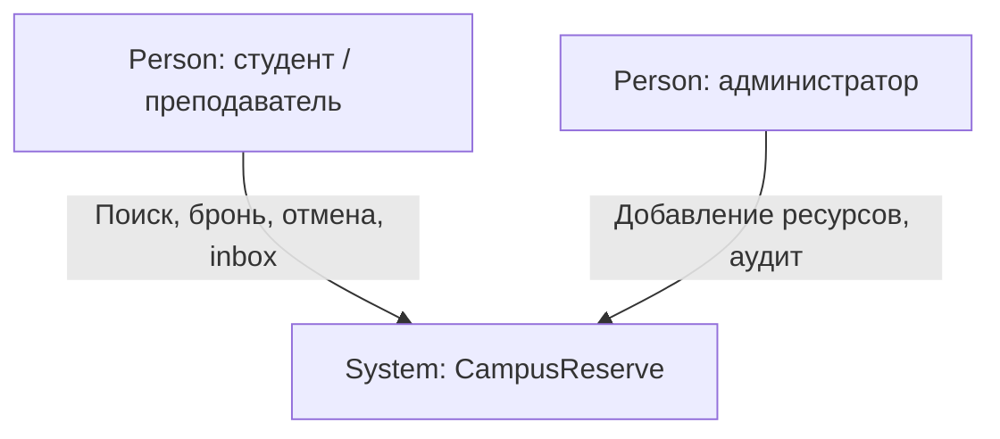
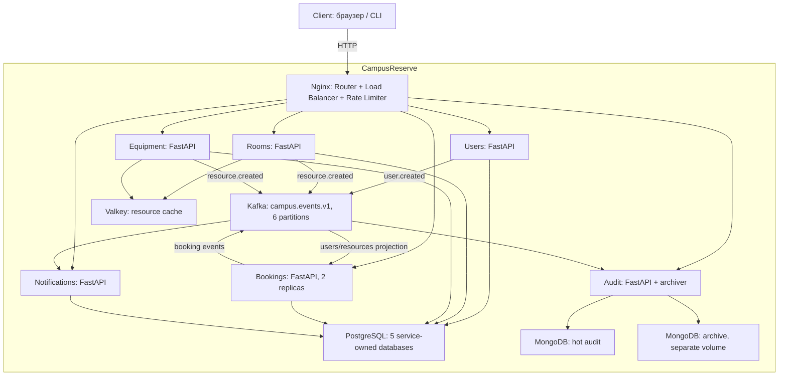
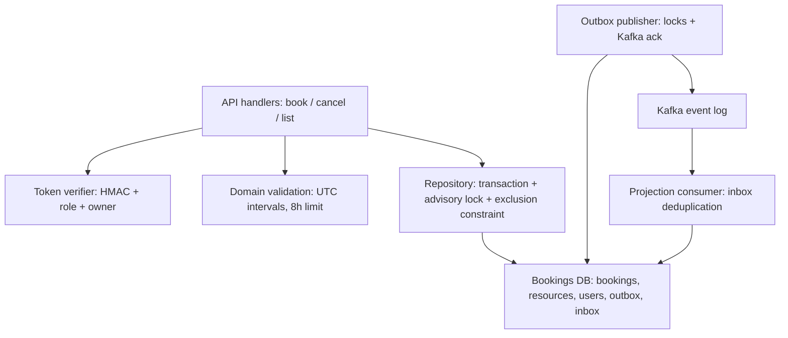

# C4 и взаимодействия

Диаграммы написаны в Mermaid и отображаются на GitHub. C4 здесь представлен через явно обозначенные границы и типы элементов. L3 раскрывает сервис бронирования; остальные контейнеры показаны на L2.

## L1 — System Context



Внешних интеграций в MVP нет. В перспективе — вузовский IdP и поставщик email, сейчас их роль не имитируется внешними вызовами.

## L2 — Containers



Каждый сервис развёртывается отдельным контейнером со своим SERVICE и отдельной учётной записью БД. Общая библиотека не делает их одним процессом: межсервисных Python-вызовов нет. Один PostgreSQL-инстанс экономит ресурсы стенда; базы и роли отдельные. Стандартный bootstrap создаёт одинаковые таблицы в каждой DB, но бизнес-сервис использует только принадлежащие ему таблицы. В production следует разделить миграции и запретить CONNECT к чужим DB, а не полагаться только на владение таблицами.

## L3 — Bookings components



Соответствие коду: API/repository — app/main.py, validation — app/domain.py, token verifier — app/security.py, consumer/publisher — app/runtime.py, constraint — app/schema.sql. Компоненты repository/API пока находятся в одном модуле: это границы ответственности, а не отдельные сервисы.

## Sequence — подтверждение и конфликт бронирования

```mermaid
sequenceDiagram
  actor U as Пользователь
  participant G as Nginx
  participant B as Bookings
  participant D as Bookings DB
  participant K as Kafka
  participant N as Notifications
  participant A as Audit
  U->>G: POST booking + token + Idempotency-Key
  G->>B: Rate limit + балансировка
  B->>B: Проверка токена и интервала
  B->>D: BEGIN; lock(user,key); lookup key
  alt Ключ уже существует с тем же телом
    D-->>B: Прежняя бронь
    B-->>U: 201, тот же ID
  else Новый запрос
    B->>D: INSERT booking + outbox
    alt Интервал занят
      D-->>B: ExclusionViolation; ROLLBACK
      B-->>U: 409
    else Интервал свободен
      B->>D: COMMIT
      B-->>U: 201 confirmed
      loop Фоновый outbox relay
        B->>D: SELECT unsent FOR UPDATE SKIP LOCKED
        B->>K: Publish booking.confirmed, key=booking_id
        K-->>B: Ack
        B->>D: Mark sent; COMMIT
      end
      K->>N: Event, group notifications-v1
      N->>N: Transaction: inbox + notification
      N->>K: Commit offset
      K->>A: Event, group audit-v1
      A->>A: Mongo upsert by event_id
      A->>K: Commit offset
    end
  end
```

Kafka ack и отметка sent не атомарны между собой: сбой после ack даёт повторную публикацию. Inbox/upsert устраняют повторный эффект; гарантия транспорта at-least-once. Отмена использует row lock и одну транзакцию status + outbox. Нет saga: бронирование единственного ресурса полностью принадлежит одной DB. Для составной брони аудитория+оборудование потребовался бы отдельный протокол согласования.
